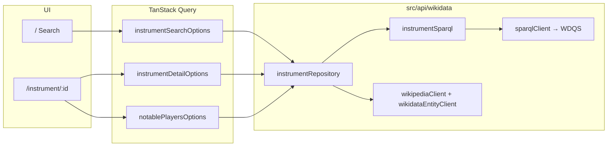

# Musical Instruments Search

A React app to search **musical instruments** (Wikidata) and open a detail page with a short Wikipedia summary and **notable players** linked to that instrument (Wikidata **P1303**).

## Stack

| Tool | Purpose |
|------|---------|
| React 19 + TypeScript | UI and type safety |
| Vite | Build tool |
| TanStack Router v1 | File-based routing |
| TanStack Query v5 | Data fetching and caching |
| Tailwind CSS v4 | Styling |
| Wikidata SPARQL + Wikipedia REST | Search, images, instrument description, player list |

No API key is required. Wikimedia APIs expect a descriptive `User-Agent` (set in `src/api/wikidata/constants.ts`).

## How data flows



1. **Search** (`/`): User submits text → `instrumentSearchOptions` runs only if `canRunInstrumentSearch` (normalized length ≥ `MIN_INSTRUMENT_SEARCH_LENGTH`, see `src/lib/wikidataValidation.ts`) → `searchInstruments` in `instrumentRepository.ts`.
2. **Search strategy** (implemented in `searchInstruments`):
   - **2 characters**: SPARQL only — English `rdfs:label` **substring** on items/classes under musical instrument (`Q34379`), with exclusions (software, program, human). EntitySearch ranks by prefix-like behavior, so short substring queries (e.g. `ia` → piano) need this path.
   - **3+ characters**: SPARQL **EntitySearch** via `wikibase:mwapi` (candidate list) → same instrument filter + exclusions. If no rows, **fallback** to the substring query.
3. **Detail** (`/instrument/$id`): Valid `Qid` → SPARQL for label, image, English Wikipedia title → `fetchWikipediaExtract`; if missing, English description from `wbgetentities`.
4. **Players**: SPARQL for humans (`P31` Q5) with `P1303` = this instrument, limit 3.

SPARQL strings live in **`src/api/wikidata/instrumentSparql.ts`**. All Wikimedia HTTP calls go through **`src/api/wikidata/wikimediaHttp.ts`** (User-Agent, timeouts from `src/lib/http.ts`). WDQS responses are validated in **`sparqlClient.ts`** so malformed JSON never reaches the UI as silent empty results.

## Project structure

```
src/
├── api/wikidata/
│   ├── constants.ts           # Endpoints, Q34379, exclusions, User-Agent
│   ├── wikimediaHttp.ts       # Shared fetch: User-Agent, timeouts, WikimediaHttpError
│   ├── instrumentSparql.ts    # All SPARQL query builders
│   ├── instrumentRepository.ts# Orchestrates queries + maps rows to domain types
│   ├── sparqlClient.ts        # WDQS JSON + validates results.bindings
│   ├── wikipediaClient.ts     # Wikipedia summary REST
│   ├── wikidataEntityClient.ts
│   └── index.ts               # Public API exports (repository functions)
├── components/                # SearchForm, InstrumentCard, TopPlayerRow, …
├── lib/
│   ├── queries.ts             # queryOptions + query keys
│   ├── wikidataValidation.ts  # Q-id validation, search normalize, min length
│   ├── http.ts, errors.ts, constants.ts, utils.ts
├── routes/                    # __root, index, instrument.$id
├── types/index.ts
└── main.tsx                   # QueryClient + Router
```

## Getting started

```bash
npm install
npm run dev
```

Open http://localhost:5173

## Production build

```bash
npm run build
npm run preview
```

## Features

- Instrument search (minimum `MIN_INSTRUMENT_SEARCH_LENGTH` characters), cards with image + name
- Detail: Wikidata id, image, English Wikipedia extract (or Wikidata description fallback)
- Up to three notable players (P1303)
- Loading and error handling; invalid Q ids rejected client-side
- Timeouts on external requests

## Note on filtered networks

Some networks block `query.wikidata.org` or `wikipedia.org`. If search or detail fails, check that those hosts are allowed.
