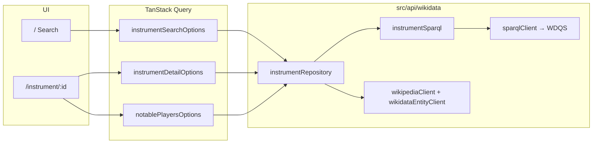

# Musical Instruments Search

A React app to search **musical instruments** (Wikidata) and open a detail page with a short Wikipedia summary and **notable players** linked to that instrument (Wikidata **P1303**).

## Original brief vs this submission

The take-home described a **music artists** search (TheAudioDB). This implementation intentionally uses **Wikidata + Wikipedia** for **instruments** instead, while keeping the same UX shape a reviewer expects:

| Brief requirement               | This app                                                                                         |
| ------------------------------- | ------------------------------------------------------------------------------------------------ |
| Search form (input + submit)    | [`SearchForm`](src/components/SearchForm.tsx) on `/`                                             |
| Results as cards (name + image) | [`InstrumentCard`](src/components/InstrumentCard.tsx) grid                                       |
| Navigate to a detail route      | `/instrument/$id` (TanStack Router)                                                              |
| Detail: name, image, biography  | Label, image, Wikipedia extract or Wikidata description                                          |
| Detail: “top 3” related items   | Up to **3 notable players** (Wikidata `P1303`) instead of tracks                                 |
| Loading + empty + error states  | Search + detail pages + [`ErrorBoundary`](src/components/AppErrorBoundary.tsx)                   |
| No API key                      | Wikimedia endpoints; descriptive `User-Agent` in [`constants.ts`](src/api/wikidata/constants.ts) |

**Optional live demo:** after you deploy (e.g. Vercel/Netlify), add the public URL here and keep the local steps below unchanged.

## Prerequisites

- **Node.js 22.x or 24.x** (LTS recommended). The repo declares `engines` in [`package.json`](package.json). If you use [nvm](https://github.com/nvm-sh/nvm), run `nvm use` in this directory (see [`.nvmrc`](.nvmrc)).

## Run locally (copy-paste)

```bash
npm ci
npm run dev
```

Open [http://localhost:5173](http://localhost:5173).

No environment variables are required.

## Other scripts

| Command           | Purpose                                              |
| ----------------- | ---------------------------------------------------- |
| `npm run build`   | Typecheck + production Vite build                    |
| `npm run preview` | Serve the `dist/` folder locally (run after `build`) |
| `npm run lint`    | ESLint                                               |
| `npm run test`    | Vitest (unit + component tests)                      |
| `npm run format`  | Prettier write                                       |

## Stack

| Tool                             | Purpose                              |
| -------------------------------- | ------------------------------------ |
| React 19 + TypeScript            | UI and type safety                   |
| Vite                             | Build tool                           |
| TanStack Router v1               | File-based routing                   |
| TanStack Query v5                | Data fetching and caching            |
| Tailwind CSS v4                  | Styling                              |
| Wikidata SPARQL + Wikipedia REST | Search, images, description, players |

## Recent improvements

- Deterministic "Top 3 notable players" ordering in SPARQL (`ORDER BY` + `LIMIT 3`).
- Normalized search query keys in TanStack Query to avoid duplicate cache entries.
- Entity snapshot in-memory cache now uses `TTL` (20 minutes) and `LRU` eviction (max 400 entries) to reduce repeated API calls in long sessions.

## How data flows



1. **Search** (`/`): User submits text → `instrumentSearchOptions` runs only if `canRunInstrumentSearch` (normalized length ≥ `MIN_INSTRUMENT_SEARCH_LENGTH`, see `src/lib/wikidataValidation.ts`) → `searchInstruments` in `instrumentRepository.ts`.
2. **Search strategy** (implemented in `searchInstruments`):
   - **2 characters**: SPARQL only — English `rdfs:label` **substring** on items/classes under musical instrument (`Q34379`), with exclusions (software, program, human). EntitySearch ranks by prefix-like behavior, so short substring queries (e.g. `ia` → piano) need this path.
   - **3+ characters**: SPARQL **EntitySearch** via `wikibase:mwapi` (candidate list) → same instrument filter + exclusions. If no rows, **fallback** to the substring query.
3. **Detail** (`/instrument/$id`): Valid `Qid` → SPARQL for label, image, English Wikipedia title → `fetchWikipediaExtract`; if missing, English description from `wbgetentities`.
4. **Players**: SPARQL for humans (`P31` Q5) with `P1303` = this instrument, limit 3.

SPARQL strings live in **`src/api/wikidata/instrumentSparql.ts`**. All Wikimedia HTTP calls go through **`src/api/wikidata/wikimediaHttp.ts`** (User-Agent, timeouts from `src/lib/http.ts`). WDQS responses are validated in **`sparqlClient.ts`** so malformed JSON never reaches the UI as silent empty results.

## Project structure

```
src/
├── api/wikidata/
│   ├── constants.ts           # Endpoints, Q34379, exclusions, User-Agent
│   ├── wikimediaHttp.ts       # Shared fetch: User-Agent, timeouts, WikimediaHttpError
│   ├── instrumentSparql.ts    # All SPARQL query builders
│   ├── instrumentRepository.ts# Orchestrates queries + maps rows to domain types
│   ├── sparqlClient.ts        # WDQS JSON + validates results.bindings
│   ├── wikipediaClient.ts     # Wikipedia summary REST
│   ├── wikidataEntityClient.ts
│   └── index.ts               # Public API exports (repository functions)
├── components/                # SearchForm, InstrumentCard, TopPlayerRow, …
├── lib/
│   ├── queries.ts             # queryOptions + query keys
│   ├── wikidataValidation.ts  # Q-id validation, search normalize, min length
│   ├── http.ts, errors.ts, constants.ts, utils.ts
├── routes/                    # __root, index, instrument.$id
├── types/index.ts
├── test/                      # Vitest setup
└── main.tsx                   # QueryClient + Router
```

## Route tree generation

Routes are file-based. The generated tree is committed as [`src/routeTree.gen.ts`](src/routeTree.gen.ts). After adding or renaming route files, run `npm run dev` or `npm run build` so the TanStack Router Vite plugin regenerates it.

## CI

GitHub Actions runs `lint`, `build`, and `test` on push and pull requests (see [`.github/workflows/ci.yml`](.github/workflows/ci.yml)).

## Git hygiene (recommended before submission)

- Do **not** commit `node_modules/`, `dist/`, or `.env` secrets.
- Prefer a **short, honest commit history** (e.g. `feat:`, `fix:`, `test:`, `ci:`) over one giant opaque commit or artificially inflated history.

## Note on filtered networks

Some networks block `query.wikidata.org` or `wikipedia.org`. If search or detail fails, check that those hosts are allowed.
